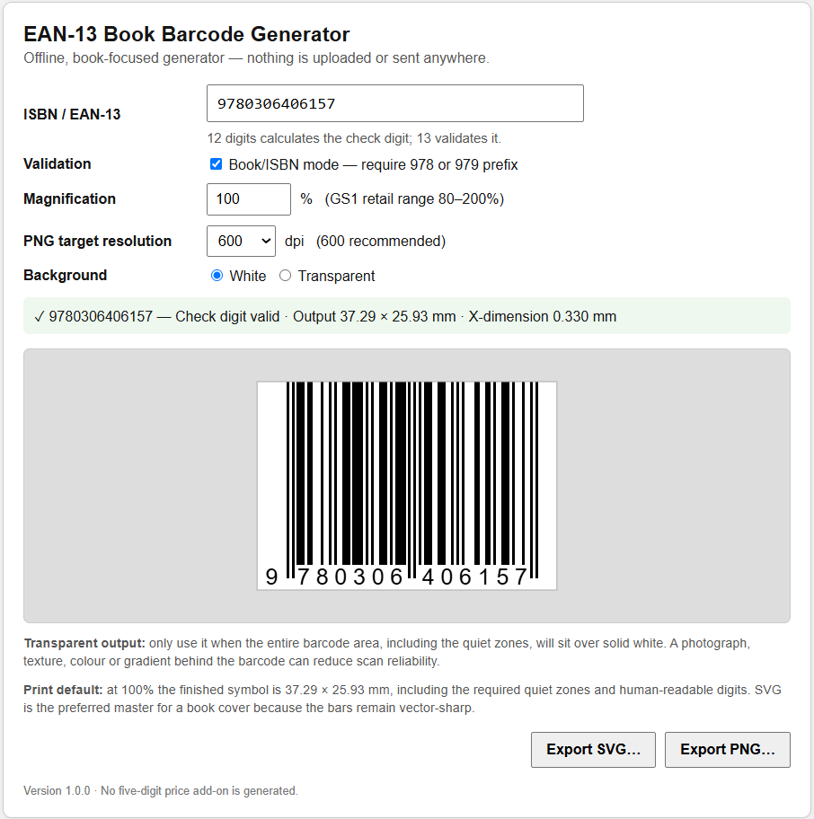
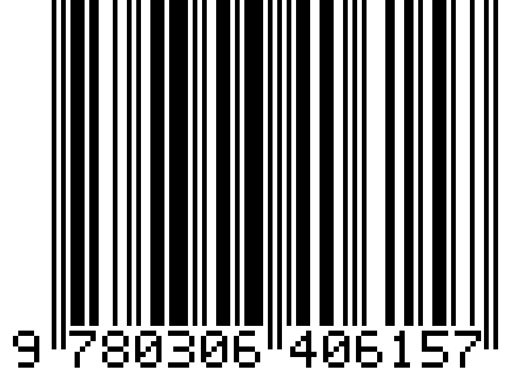

# EAN-13 Book Barcode Generator

A free, offline, dependency-free EAN-13 barcode generator designed specifically for ISBN-13 book-cover production.

**No account. No upload. No tracking. No barcode font. No external library required.**



## Quick start

The easiest version is the browser app:

1. Download `standalone/EAN13_Book_Barcode_Generator.html`.
2. Double-click the file.
3. Enter an ISBN-13, or the first 12 digits and let the app calculate the check digit.
4. Export **SVG** for a print-cover master, or **PNG** if your layout workflow requires raster artwork.

The app runs entirely in your browser from the local file. It does not need an internet connection or a web server.

You can also use the repository's `index.html` directly through GitHub Pages. Barcode generation still happens entirely client-side in the browser.

## What it does

- Encodes true **EAN-13** bar patterns rather than using a barcode-lookalike font.
- Accepts **12 digits** and calculates the EAN-13 check digit.
- Accepts **13 digits** and validates the supplied check digit.
- Provides a **Book/ISBN mode** that requires a `978` or `979` prefix.
- Exports **SVG** with vector bars.
- Exports high-resolution **PNG** with integer-pixel barcode modules for crisp edges.
- Supports **white** or **transparent** backgrounds.
- Preserves EAN-13 quiet zones.
- Supports the standard 80%–200% retail magnification range.
- Displays the 13 human-readable EAN digits.
- Generates no five-digit price add-on.

## Recommended book-cover workflow

For ordinary print-cover use:

- Leave **Book/ISBN mode** enabled.
- Leave magnification at **100%** unless your printer or distributor requires something different.
- Use a **white background**.
- Export **SVG** and place it at its native physical size in your cover layout.
- Do not stretch the barcode disproportionately after export.
- Keep the full white quiet-zone area unobstructed.

Transparent output is available, but only use it when the entire barcode area — including both quiet zones — sits over solid white. A coloured, textured, photographic or gradient background can reduce scan reliability.

## Nominal EAN-13 dimensions at 100%

| Item | Dimension |
|---|---:|
| X-dimension / module | 0.330 mm |
| Encoded EAN-13 symbol | 31.35 mm / 95 modules |
| Left quiet zone | 3.63 mm / 11 modules |
| Right quiet zone | 2.31 mm / 7 modules |
| Overall width including quiet zones | 37.29 mm |
| Normal bar height | 22.85 mm |
| Overall symbol height including human-readable digits | 25.93 mm |

GS1's current General Specifications identify the EAN-13 left and right quiet zones as 11X and 7X respectively and use 0.330 mm as the target X-dimension. See the [GS1 General Specifications](https://ref.gs1.org/standards/genspecs/).

## ISBN notes

ISBN-13 is compatible with EAN-13 encoding and uses `978` or `979` prefixes. The International ISBN Agency's current [ISBN Users' Manual page](https://www.isbn-international.org/content/isbn-users-manual/29) is the authoritative starting point for ISBN-specific guidance.

This generator intentionally does **not** add the five-digit price supplement. Historically, that supplement has been used mainly in the United States and Canada for book-trade pricing and is not normally needed for Australian publishing.

Some publishing workflows also display the formatted text `ISBN 978-…` near the barcode. This utility generates the EAN-13 symbol and its required human-readable EAN digits; add any publisher-specific ISBN caption or surrounding text in your cover-layout application if your printer, distributor or local ISBN guidance requires it.

## SVG or PNG?

**SVG is recommended for book covers.** The bars are vector rectangles, so they remain sharp through normal print workflows.

PNG is provided for applications that cannot use SVG. The PNG exporter rounds each barcode module to an integer number of pixels, then records the corresponding physical resolution in the PNG metadata. This avoids soft or uneven bar edges caused by fractional-pixel modules.

## Browser version

`index.html` and `standalone/EAN13_Book_Barcode_Generator.html` contain the full application: HTML, CSS and JavaScript in one file. There are no external scripts, fonts, analytics or network calls.

That makes the app suitable for:

- offline use;
- archiving with a publishing project;
- GitHub Pages;
- sharing as a single file;
- inspecting the complete source before use.

## Python desktop version

An alternative Python/Tkinter version is under [`python/`](python/).

It requires only Python 3 and Tkinter. No third-party Python packages are used.

Windows:

```text
py -3 python/ean13_book_barcode.py
```

Or double-click `python/run_barcode_generator.bat` after ensuring Python is available.

macOS / Linux:

```text
python3 python/ean13_book_barcode.py
```

Some Linux distributions package Tkinter separately. On Debian/Ubuntu:

```text
sudo apt install python3-tk
```

## Self-test

The Python version includes simple known-value tests:

```text
python3 python/ean13_book_barcode.py --self-test
```

Expected result:

```text
EAN-13 Book Barcode Generator 1.0.0: all self-tests passed
```

The browser version also performs several internal assertions on startup in the browser console.

## Example output

The [`examples/`](examples/) directory contains both SVG and PNG output for the well-known example ISBN `9780306406157`.



## Use online

You can run the generator directly in your browser using the GitHub Pages version.

Barcode generation and export are performed locally in your browser. The ISBN you enter is not transmitted to a server by this application.

## Scope and verification

This project generates EAN-13 artwork from supplied digits. It is **not** a GS1, ISBN Agency, printer, retailer or barcode-verification service.

A technically correct digital image can still become unreadable because of print gain, scaling, low contrast, insufficient resolution, trimming, artwork placed inside quiet zones, unsuitable substrate, or other production factors. Where formal barcode verification is required, use an appropriate verification service or follow the requirements of your printer/distributor.

## Privacy

The browser app contains no network code and no analytics. Entered ISBN/EAN values remain in the local browser session.

## Licence

Released under the [MIT License](LICENSE).

Copyright © 2026 Peter Rodger.
